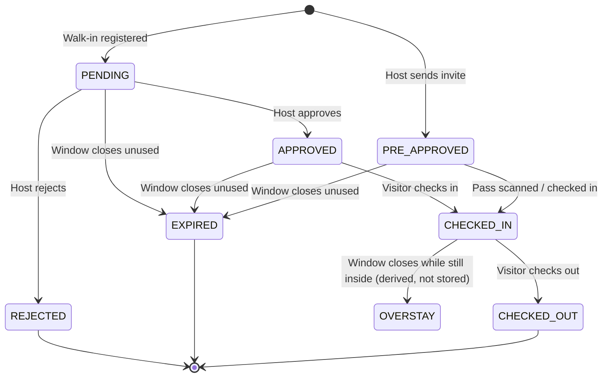
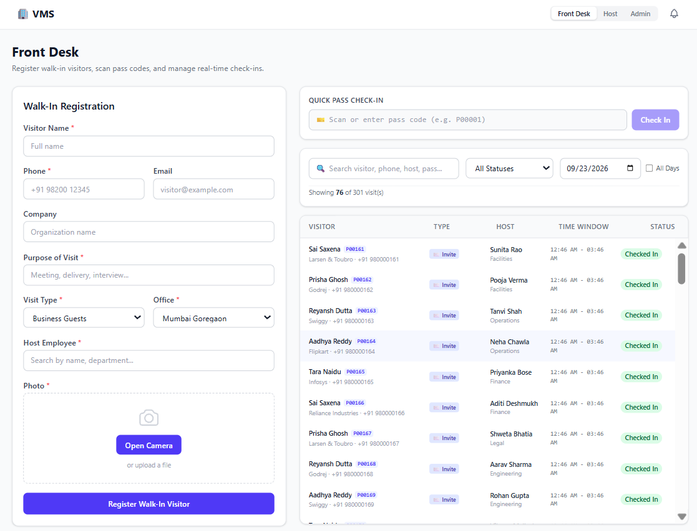
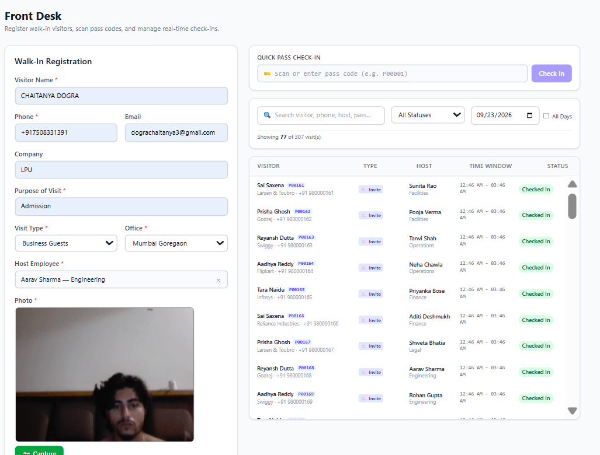
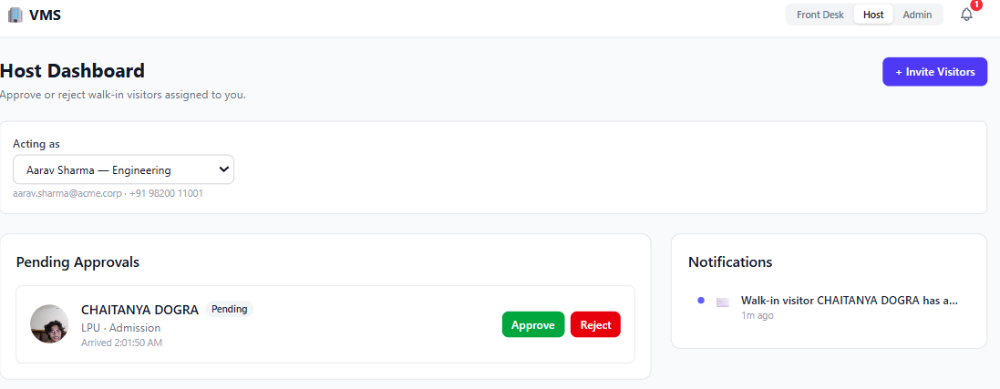
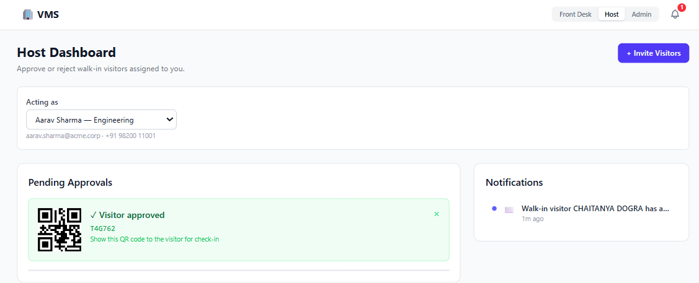
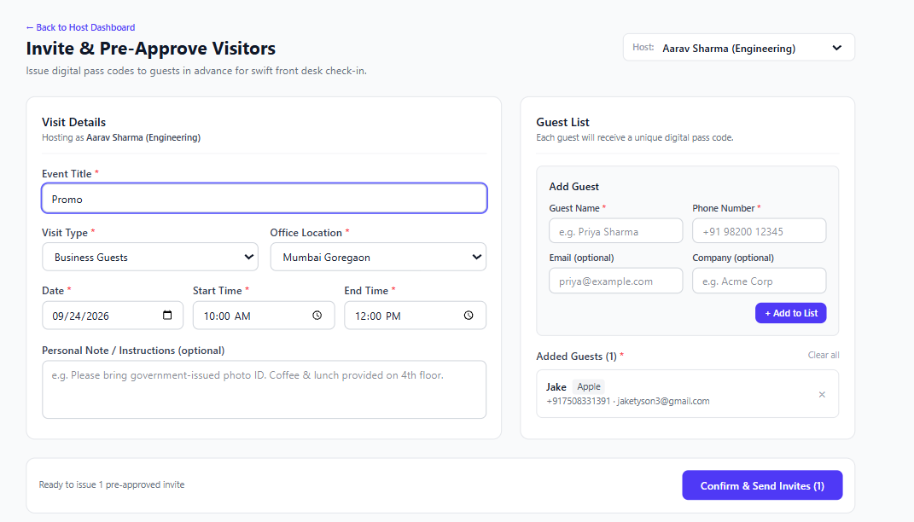
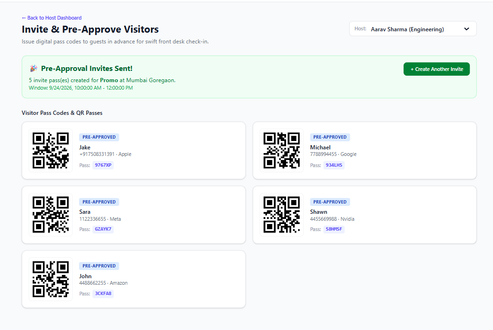
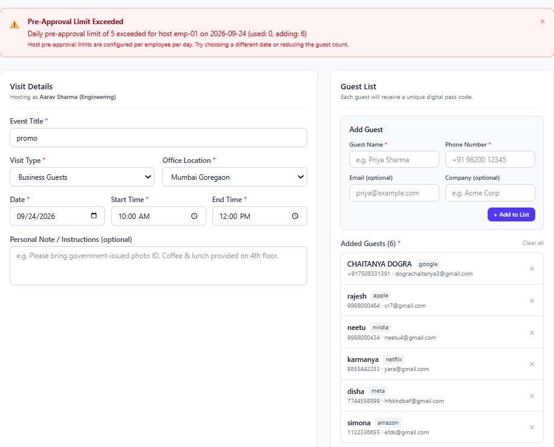
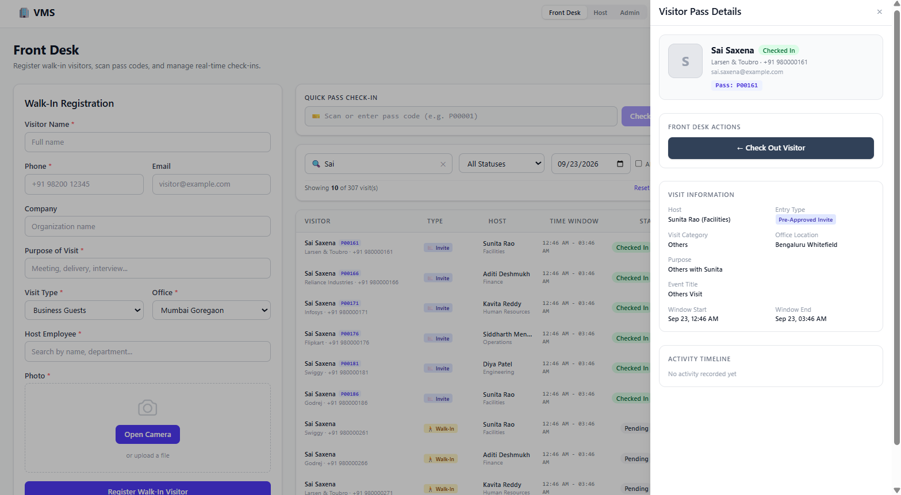
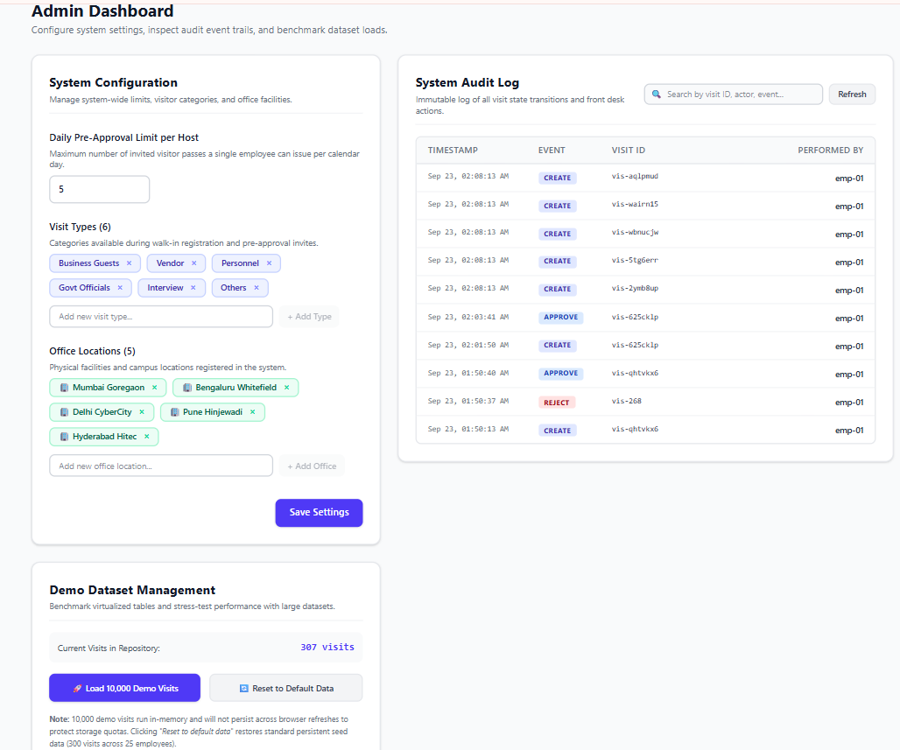

# Visitor Management System

A full-featured, frontend-only Visitor Management System built for the MoveInSync campus case study (Case Study 1). It covers walk-in registration, host approval workflows, QR-code pre-approval invites, front-desk check-in/out, and system administration — all backed by a strongly-typed domain model and a mock API layer designed to mirror how a real backend would behave.

**Live demo:** https://visitor-management-system-ten-rho.vercel.app

**Repository:** https://github.com/dograchaitanya20/visitor-management-system

---

## Table of Contents
- [Features](#features)
- [Tech Stack](#tech-stack)
- [Getting Started](#getting-started)
- [Architecture](#architecture)
- [Visit Lifecycle (State Machine)](#visit-lifecycle-state-machine)
- [Complexity & Performance](#complexity--performance)
- [Error Handling](#error-handling)
- [Feature Checklist vs. Case Study Requirements](#feature-checklist-vs-case-study-requirements)
- [Testing](#testing)
- [Screenshots](#screenshots)
- [What I'd Do With a Real Backend](#what-id-do-with-a-real-backend)

---

## Features

### 1. Visitor Registration (Front Desk)
Walk-in visitors are registered with name, phone, email, company, purpose, visit type, office, host (searched live from the employee directory), and a mandatory photo — captured live via webcam or uploaded as a fallback. On submit, the host is notified immediately and the visit enters a `PENDING` state.

### 2. Host Approval Workflow
Each host has a dedicated dashboard showing only their pending walk-ins, with visitor photo, purpose, and arrival time. Approving generates a QR pass code instantly; rejecting requires confirmation and notifies security. All actions are protected against double-submission.

### 3. Pre-Approval / Invite Visitors
Hosts can pre-approve a batch of guests for a scheduled visit window (date, start/end time, office, visit type). Each guest receives a unique QR pass code. The daily pre-approval limit (default: 5 per host per day) is enforced **atomically** — if the batch would exceed the limit, nothing is created and the host sees exactly how many they've used and how many they attempted to add.

### 4. Front Desk Dashboard
A live, searchable, filterable table of all visits (by name/phone/host/pass code, status, and date range), backed by row virtualization so it stays smooth even with thousands of records. Clicking a row opens a detail drawer with the full visit history, current status, and context-appropriate actions (Check In / Check Out). A "Quick Pass Check-In" box lets front-desk staff scan or type a pass code directly.

### 5. Admin Panel
System-wide configuration (daily pre-approval limit, visit type categories, office locations), a full audit log of every state transition in the system (searchable, paginated), and a demo data panel for stress-testing the UI with 10,000 generated visits.

---

## Tech Stack

| Layer | Choice |
|---|---|
| Framework | React 19 + TypeScript (strict mode) |
| Build tool | Vite |
| Styling | Tailwind CSS |
| State management | Zustand |
| Forms & validation | react-hook-form + Zod |
| Routing | react-router-dom |
| List virtualization | @tanstack/react-virtual |
| QR codes | qrcode.react |
| Testing | Vitest + Testing Library |
| Persistence | Browser localStorage (mock backend) |
| Deployment | Vercel |

No backend server exists in this submission — the case study explicitly allows mock data for a frontend assignment. See [What I'd Do With a Real Backend](#what-id-do-with-a-real-backend) for how this would evolve.

---

## Getting Started

```bash
git clone https://github.com/dograchaitanya20/visitor-management-system.git
cd visitor-management-system
npm install
npm run dev
```

Open `http://localhost:5173`. The app seeds itself automatically with 25 employees, 6 visit types, 5 offices, and ~300 sample visits in mixed states on first load — no setup required.

```bash
npm test -- --run   # run the full test suite (57 tests)
npm run build        # production build
```

---

## Architecture

The codebase is layered so that UI, business rules, and data access never bleed into each other:

```
src/
├─ domain/         Pure business logic — no React, no I/O, fully unit-testable
│  ├─ types.ts         Core types: Visit, Visitor, Employee, Settings, AuditEvent
│  ├─ stateMachine.ts  The single source of truth for legal status transitions
│  └─ rules.ts         effectiveStatus, checkPass, canPreApprove, validateWindow
│
├─ api/            Mock backend — simulates a real API's contract
│  ├─ repo.ts          CRUD + business operations, in-memory indexes, persistence
│  ├─ notifier.ts      In-memory notification log (email/SMS/push simulation)
│  ├─ seed.ts          Deterministic seed data + high-volume generator
│  └─ errors.ts        Typed AppError with specific error codes
│
├─ store/          Zustand stores — the only layer allowed to call src/api/
│  ├─ session.ts       Current role + acting employee (persisted to sessionStorage)
│  ├─ visits.ts        Visit list, filters, loading/error state
│  ├─ notifications.ts Notification feed
│  └─ toast.ts         Global toast queue
│
├─ features/       One folder per screen, composed from store + domain + ui
│  ├─ registration/    Walk-in form, host search, photo capture
│  ├─ approvals/       Host inbox, notification feed
│  ├─ invite/          Pre-approval form, guest picker
│  ├─ frontdesk/       Visitor table, details drawer, pass scan
│  └─ admin/           Settings, audit log, demo data tools
│
├─ components/ui/  Shared, reusable primitives (Badge, Drawer, Modal, Toast, Table)
└─ pages/          One route component per screen, composing the features above
```


**Why this separation matters:** `src/domain/` has zero dependencies on React or any storage mechanism — it's tested in isolation (28 tests) and is the *only* place that decides whether a status transition is legal. Every layer above it — the mock API, the stores, the UI — defers to it rather than re-implementing the rules. This is also what makes the mock API layer a drop-in replacement target: swap `src/api/repo.ts`'s internals for real HTTP calls, and nothing in `domain/`, `store/`, or `features/` needs to change.

---

## Visit Lifecycle (State Machine)

Every visit moves through a strict, centrally-enforced state machine (`src/domain/stateMachine.ts`). No screen is allowed to set a status directly — every transition goes through `transition(status, event)`, which throws `IllegalTransitionError` on any invalid move (e.g. checking out a visit that was never checked in).



**`OVERSTAY` is never stored** — it's derived at read time by `effectiveStatus(visit, now)`, which compares the visit's stored status against the current window end. This means the correct status is always shown, even after a page refresh, with zero background jobs or polling.

---

## Complexity & Performance

| Operation | Approach | Complexity |
|---|---|---|
| Get visit by ID | `Map<id, Visit>` lookup | O(1) |
| Check in by pass code | `Map<passCode, visitId>` index | O(1) |
| Daily pre-approval limit check | `Map<hostId\|day, count>` counter | O(1) |
| Effective status (incl. overstay/expiry) | Computed lazily at read time, no stored flag | O(1) per visit |
| Table search/filter | Debounced, client-side | O(n) per keystroke |
| Rendering the visitor table | Row virtualization (`@tanstack/react-virtual`) | O(visible rows), not O(total rows) |
| Audit log storage | Append-only array | O(1) write, O(n) paginated read |

**Benchmark:** Generating 10,000 fully-formed visit records (with visitors and rebuilt in-memory indexes) takes **~77–97ms** on a mid-range laptop, measured via the Admin panel's "Load 10,000 Demo Visits" tool. The visitor table remains smooth while scrolling through this dataset because only the rows currently in the viewport are ever mounted to the DOM.

**Scaling to a real backend:** the same index strategy maps directly onto database indexes — `passCode` and `(hostId, windowStart)` would be indexed columns, the table would use server-side pagination instead of loading everything into memory, and the notification system would move from an in-memory array to a message queue (see [What I'd Do With a Real Backend](#what-id-do-with-a-real-backend)).

---

## Error Handling

- **Every form field validates inline** (via Zod schemas) — no submit-and-hope; errors appear under the specific field, not just as a toast.
- **Domain rules are enforced twice**: once in the UI (a Check-In button simply doesn't render for a `PENDING` visit) and once in the API layer (calling `applyEvent` on an illegal transition throws a typed `AppError` with code `ILLEGAL_TRANSITION`, regardless of how the request was triggered).
- **Pre-approval limits are atomic**: `createInvites` validates the time window and the daily quota *before* creating any record. A batch that would exceed the limit creates nothing and returns a specific, actionable message (`"Daily pre-approval limit of 5 exceeded for host X on Y (used: A, adding: B)"`) — the form is preserved so the host can adjust rather than starting over.
- **Pass code check-in gives specific reasons**, not a generic failure: `"Invalid pass code"`, `"This pass has expired"`, and `"Too early: the visit window has not started"` are all distinguished.
- **Camera permission denial** falls back to file upload with a visible explanation, rather than a blank screen.
- **Storage quota exceeded** (from loading very large demo datasets) is caught and surfaced once, without crashing the app — the app continues to function in-memory.

---

## Feature Checklist vs. Case Study Requirements

| Requirement (Case Study 1: Visitor Management System) | Status |
|---|---|
| Visitor registration — name, contact, purpose, host, company | ✅ |
| Mandatory photo capture at registration | ✅ (webcam + file fallback) |
| Check-in / check-out time logging | ✅ (automatic, timestamped) |
| Host approval workflow with real-time notification | ✅ (simulated email/SMS/push) |
| Approve / reject with access grant or denial | ✅ |
| Pre-approval for a scheduled date/time window | ✅ |
| QR code / e-pass generation and scanning | ✅ |
| Automatic expiry of unused pre-approved passes | ✅ |
| Pre-approval limits per employee per day | ✅ (enforced atomically) |
| Complexity analysis (time/space) | ✅ (see above) |
| Intuitive UI with operation feedback | ✅ (toasts, inline errors, loading/empty states) |
| Graceful error handling with informative messages | ✅ |
| Performance under large datasets | ✅ (10k-row benchmark + virtualized table) |
| Scalability considerations documented | ✅ (see below) |

---

## Testing

**57 tests across 7 files**, run with `npm test -- --run`:

- `domain.test.ts` (28) — every legal and illegal state transition, overstay/expiry boundary conditions, pre-approval limit math, window validation, pass-check timing rules
- `repo.test.ts` (14) — full visit lifecycles end-to-end, atomic invite creation, index consistency, storage failure handling
- `invite.test.tsx` (4) — guest picker, invite creation, limit-exceeded UI
- `frontdesk.test.tsx` (5) — table rendering/filtering, pass-code check-in, illegal check-in blocking
- `admin.test.tsx` (4) — settings persistence, audit log, demo data loading
- `notifications.test.tsx` (1) — notification bell and drawer
- `smoke.test.ts` (1) — environment sanity check

The domain layer's tests run with an injectable clock, so time-dependent behavior (expiry, overstay, the 15-minute early check-in grace period) is tested deterministically rather than relying on real elapsed time.

---

## Screenshots

**Front Desk — registration and live visitor table**


**Registration — live camera capture with all fields populated**


**Host Dashboard — pending approvals**


**Host Dashboard — after approval, QR pass generated**


**Invite & Pre-Approve Visitors**


**Invite results — QR passes for every guest**


**Daily pre-approval limit enforcement**


**Front Desk — search, filter, and visitor details drawer**


**Admin Dashboard — settings and audit log**


---

## What I'd Do With a Real Backend

- **Replace `src/api/repo.ts`'s internals with HTTP calls** to a real service — the function signatures stay identical, so nothing in `domain/`, `store/`, or `features/` would need to change.
- **Move the state machine enforcement to the server** as the source of truth, keeping the client-side copy for optimistic UI and instant feedback.
- **Index `passCode` and `(hostId, windowStart)`** as real database indexes (e.g. PostgreSQL), replacing the in-memory `Map`s directly.
- **Server-side pagination** for the visitor table and audit log, instead of loading the full dataset into the browser.
- **Real notifications** via a message queue (SQS/RabbitMQ) feeding actual email/SMS providers (SendGrid/Twilio), replacing the in-memory notifier.
- **WebSocket or Server-Sent Events** so a host's approval instantly updates the front desk's table without a manual refresh.
- **Authentication and RBAC**, replacing the current "acting as" employee picker with real login and JWT-based host/admin permissions.
- **Code-splitting** the production bundle (currently a single ~520KB chunk) via dynamic `import()` per route, now that there are multiple distinct feature areas.
